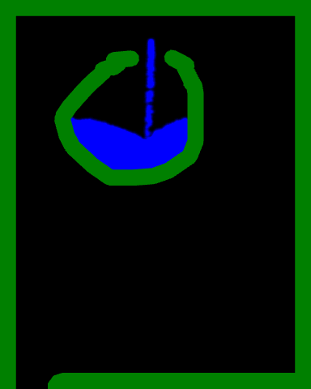
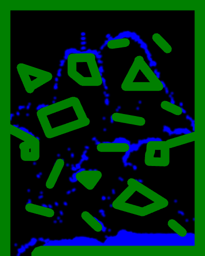
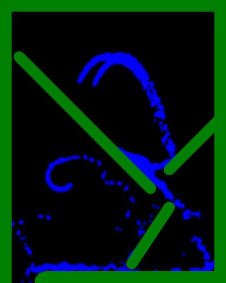

# 2D Smoothed Particle Hydrodynamics...

Trying to implement 2D water simulation in WebGL using Smoothed Particle Hydrodynamics...

<table><thead>
</thead><tbody>
<tr>
<td align="center"></td>
<td align="center"></td>
</tr>
<tr>
<td align="center"> <a href="json/obstacles.json">container.json</a> </td>
<td align="center"> <a href="json/obstacles.json">obstacles.json</a> </td>
</tr>

<tr>
<td align="center"></td>
<td align="center"></td>
</tr>
<tr>
<td align="center"> <a href="json/red.json">red.json</a> </td>
<td align="center"> <a href="json/ramps.json">ramps.json</a> </td>
</tr>

<tr>
<td align="center"></td>
<td align="center"></td>
</tr>
<tr>
<td align="center"> <a href="json/simple.json">simple.json</a> </td>
<td align="center"> <a href="json/sprinkler.json">sprinkler.json</a> </td>
</tr>

</tbody></table>

